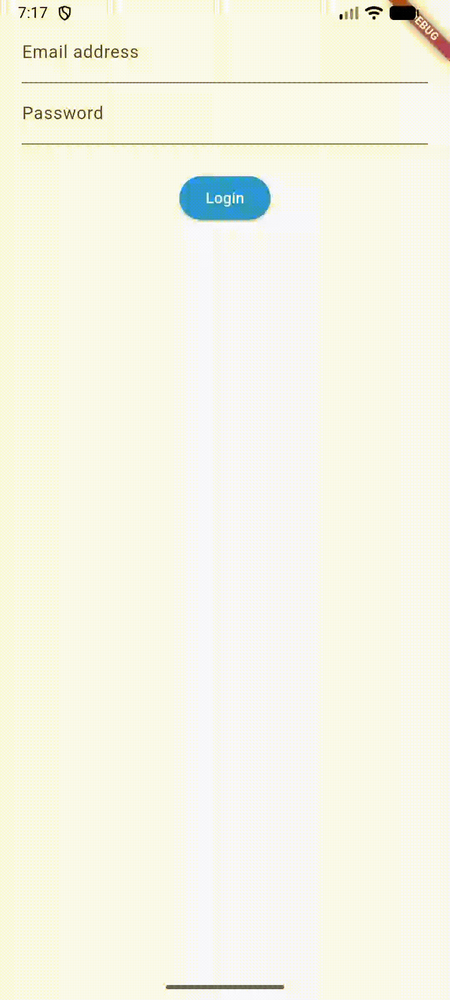

# Stateful Login

A Flutter project demonstrating state management using `StatefulWidget` with a Login screen example.



---

## Table of Contents

- [Overview](#overview)
- [State Management in Flutter](#state-management-in-flutter)
- [Project Structure](#project-structure)
- [Widget Hierarchy](#widget-hierarchy)
- [Key Concepts](#key-concepts)
  - [StatefulWidget](#statefulwidget)
  - [State Class](#state-class)
  - [Mixins](#mixins)
- [Widgets Used](#widgets-used)
- [Properties & Methods](#properties--methods)
- [Form Validation](#form-validation)
- [Code Walkthrough](#code-walkthrough)

---

## Overview

This project serves as a learning resource for understanding how to build stateful applications in Flutter. The login screen demonstrates:

- Creating and managing state with `StatefulWidget`
- Form handling and validation
- Using mixins for code reusability
- Flutter's widget composition pattern

---

## State Management in Flutter

| Approach | Description | Best For |
|----------|-------------|----------|
| `StatefulWidget` | Built-in Flutter approach, easier to understand | Small to medium apps, learning |
| `BLoC` Pattern | Recommended by Flutter team, separates business logic | Large, complex applications |

---

## Project Structure

```
lib/
├── main.dart                    # Entry point - runApp()
└── src/
    ├── app.dart                 # Root widget (MaterialApp)
    ├── mixins/
    │   └── validator_mixin.dart # Validation logic (reusable)
    └── screens/
        └── login_screen.dart    # StatefulWidget login screen
```

---

## Widget Hierarchy

```
App (StatelessWidget)
└── MaterialApp
    └── Scaffold
        └── LoginScreen (StatefulWidget)
            └── Container
                └── Form
                    └── Column
                        ├── TextFormField (Email)
                        ├── TextFormField (Password)
                        ├── SizedBox (Spacing)
                        └── ElevatedButton (Submit)
```

---

## Key Concepts

### StatefulWidget

A widget that has mutable state. It's composed of two classes:

1. **StatefulWidget class** - Immutable, creates the State object
2. **State class** - Mutable, holds the state and builds the UI

```dart
class LoginScreen extends StatefulWidget {
  const LoginScreen({super.key});

  @override
  createState() {
    return LoginScreenState();
  }
}
```

**Key Points:**
- `createState()` method returns a new instance of the State class
- The widget itself is immutable; only the State object changes
- State persists across rebuilds until the widget is removed from the tree

### State Class

The State class is where the actual logic and mutable data lives:

```dart
class LoginScreenState extends State<LoginScreen> with ValidationMixin {
  // Mutable state
  String email = '';
  String password = '';
  
  @override
  Widget build(BuildContext context) {
    // Returns the UI
  }
}
```

**Key Points:**
- Extends `State<T>` where `T` is the StatefulWidget type
- Contains the `build()` method that returns the widget tree
- State changes trigger UI rebuilds via `setState()` (not used here since form handles state internally)

### Mixins

Mixins allow code reuse across multiple classes. Think of it as "copy-pasting" methods into a class.

```dart
mixin ValidationMixin {
  String? validateEmail(String? value) { ... }
  String? validatePassword(String? value) { ... }
}

// Usage: "with" keyword
class LoginScreenState extends State<LoginScreen> with ValidationMixin {
  // Now has access to validateEmail() and validatePassword()
}
```

**Why use Mixins?**
- Avoid code duplication
- Share functionality across unrelated classes
- Dart doesn't support multiple inheritance, mixins are the solution

---

## Widgets Used

### 1. MaterialApp

The root widget that provides Material Design styling.

| Property | Type | Description |
|----------|------|-------------|
| `title` | `String` | Application title (shown in task switcher) |
| `home` | `Widget` | The default route's widget |

### 2. Scaffold

Provides the basic Material Design visual structure.

| Property | Type | Description |
|----------|------|-------------|
| `body` | `Widget` | Primary content of the scaffold |

### 3. Container

A convenience widget that combines padding, margins, constraints, and decoration.

| Property | Type | Description |
|----------|------|-------------|
| `margin` | `EdgeInsets` | Empty space around the container |
| `child` | `Widget` | The widget inside the container |

### 4. Form

Groups and validates form fields together.

| Property | Type | Description |
|----------|------|-------------|
| `key` | `GlobalKey<FormState>` | Identifies the form and allows access to its state |
| `child` | `Widget` | The form content (usually a Column) |

### 5. Column

Arranges children vertically.

| Property | Type | Description |
|----------|------|-------------|
| `children` | `List<Widget>` | List of widgets to display vertically |

### 6. TextFormField

A text input field integrated with `Form` for validation.

| Property | Type | Description |
|----------|------|-------------|
| `decoration` | `InputDecoration` | Visual styling (label, hint, borders) |
| `keyboardType` | `TextInputType` | Type of keyboard to show |
| `obscureText` | `bool` | Hides text (for passwords) |
| `obscuringCharacter` | `String` | Character to show when obscured |
| `validator` | `String? Function(String?)` | Validation function |
| `onSaved` | `void Function(String?)` | Called when form is saved |

### 7. InputDecoration

Defines the appearance of a `TextFormField`.

| Property | Type | Description |
|----------|------|-------------|
| `labelText` | `String` | Label that floats when focused |
| `hintText` | `String` | Placeholder text |

### 8. SizedBox

A box with a specific size, used for spacing.

| Property | Type | Description |
|----------|------|-------------|
| `height` | `double` | Fixed height in pixels |
| `width` | `double` | Fixed width in pixels |

### 9. ElevatedButton

A Material Design elevated button.

| Property | Type | Description |
|----------|------|-------------|
| `onPressed` | `VoidCallback` | Called when button is tapped |
| `style` | `ButtonStyle` | Visual styling |
| `child` | `Widget` | Button content (usually Text) |

---

## Properties & Methods

### GlobalKey&lt;FormState&gt;

```dart
final formKey = GlobalKey<FormState>();
```

A special key that uniquely identifies the Form widget and provides access to its state.

**Methods on `formKey.currentState`:**

| Method | Description |
|--------|-------------|
| `validate()` | Runs all validators, returns `true` if all pass |
| `save()` | Calls `onSaved` on each form field |
| `reset()` | Resets all form fields to initial values |

### TextInputType

Controls the keyboard layout shown to the user:

| Type | Description |
|------|-------------|
| `TextInputType.emailAddress` | Email keyboard with @ and .com |
| `TextInputType.text` | Standard text keyboard |
| `TextInputType.number` | Numeric keyboard |
| `TextInputType.phone` | Phone number keyboard |

### ButtonStyle & WidgetStatePropertyAll

```dart
style: ButtonStyle(
  backgroundColor: WidgetStatePropertyAll(Colors.blue)
)
```

`WidgetStatePropertyAll` applies the same value for all button states (pressed, hovered, disabled, etc.).

---

## Form Validation

### How Validation Works

1. **Define validators** - Functions that return `null` for valid input, or an error message string for invalid input

```dart
String? validateEmail(String? value) {
  if (value != null && value.isNotEmpty) {
    if (!value.contains('@')) {
      return 'Please enter a valid email';  // Error message
    }
  }
  return null;  // Valid
}
```

2. **Attach validators to fields** - Use the `validator` property

```dart
TextFormField(
  validator: validateEmail,  // Reference to validation function
)
```

3. **Trigger validation** - Call `formKey.currentState?.validate()`

```dart
if (formKey.currentState?.validate() ?? false) {
  // All fields are valid
  formKey.currentState?.save();  // Triggers onSaved callbacks
}
```

### Validation Flow Diagram

```
User taps Login button
        ↓
formKey.currentState?.validate()
        ↓
Each TextFormField's validator runs
        ↓
    ┌───────────────────────────────┐
    │ Returns null? → Field valid   │
    │ Returns String? → Show error  │
    └───────────────────────────────┘
        ↓
All valid? → formKey.currentState?.save()
        ↓
Each onSaved callback fires → Values stored in state
```

---

## Code Walkthrough

### Entry Point (`main.dart`)

```dart
void main() {
  runApp(App());
}
```

- `runApp()` inflates the given widget and attaches it to the screen

### Root Widget (`app.dart`)

```dart
class App extends StatelessWidget {
  @override
  Widget build(BuildContext context) {
    return MaterialApp(
      title: 'Login',
      home: Scaffold(body: LoginScreen()),
    );
  }
}
```

- `StatelessWidget` because it has no mutable state
- Sets up the Material app shell

### Login Screen (`login_screen.dart`)

**State Variables:**
```dart
final formKey = GlobalKey<FormState>();  // Form identifier
String email = '';                        // Stores email after save
String password = '';                     // Stores password after save
```

**Build Method:**
```dart
@override
Widget build(BuildContext context) {
  return Container(
    margin: const EdgeInsets.all(20.0),
    child: Form(
      key: formKey,
      child: Column(
        children: [
          emailField(),
          passwordField(),
          const SizedBox(height: 25.0),
          submitButton(),
        ],
      ),
    ),
  );
}
```

**Submit Handler:**
```dart
onPressed: () {
  final isFormValid = formKey.currentState?.validate() ?? false;
  
  if (isFormValid) {
    formKey.currentState?.save();
    debugPrint('Email: $email, Password: $password');
  }
}
```

### Validation Mixin (`validator_mixin.dart`)

```dart
mixin ValidationMixin {
  String? validateEmail(String? value) {
    if (value != null && value.isNotEmpty) {
      if (!value.contains('@')) {
        return 'Please enter a valid email';
      }
    }
    return null;
  }

  String? validatePassword(String? value) {
    if (value != null && value.isNotEmpty) {
      if (value.length < 4) {
        return 'Password must be at least 4 characters';
      }
    }
    return null;
  }
}
```

---

## Key Learnings

1. **StatefulWidget Pattern**: Separation of immutable widget definition and mutable state management
2. **Form Handling**: Using `GlobalKey<FormState>` to coordinate form validation and data collection
3. **Mixins**: Reusable code without inheritance hierarchy constraints
4. **Widget Composition**: Building complex UIs by composing simple widgets
5. **Null Safety**: Using `?` and `??` operators for safe null handling

---

## License

This project is for educational purposes.
